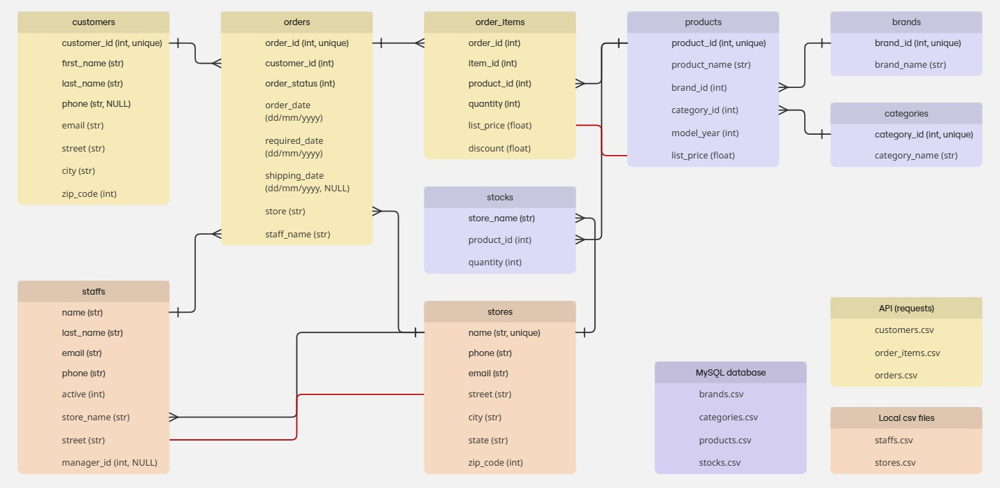

# ETL processes

## Initial schema

* Red lines are connecting duplicate data, where I expect to remove one of the instances.

## Plan
* Write connector classes.
    * The connector class for the API and database should have an option for using the csv connector in case of bad internet.
* Write class for interacting with new database.
    * local MongoDB database. MongoDB because of overlap with job interview assignment.